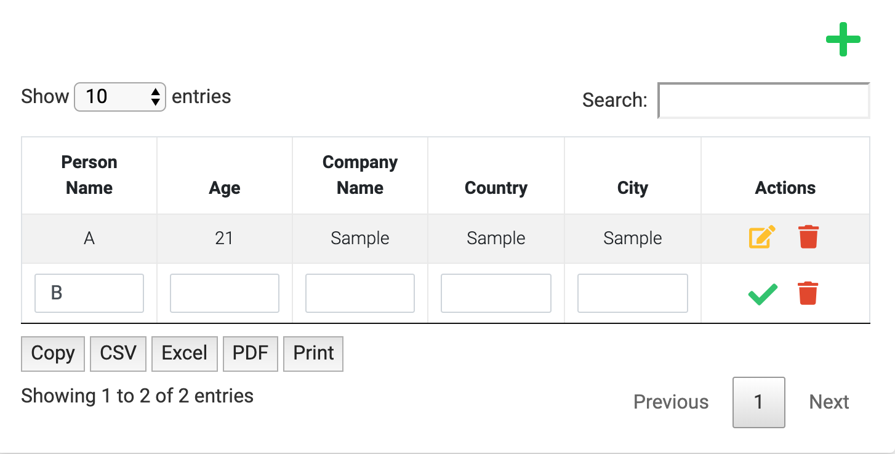

# Datatables-Edit

This repository contains HTML+CSS+JS code
using Datatables for Bootstrap and extending
it to include add/edit/delete options.

The table has following features demonstrated
* search
* pagination
* scroll
* export to CSV, PDF, Excel
* send to printer
* add
* edit
* delete

## How to install and execute
Open `index.html`

## Sample Output

## Whom to contact?

Please direct your queries to [gpavanb1](http://github.com/gpavanb1)
for any questions.